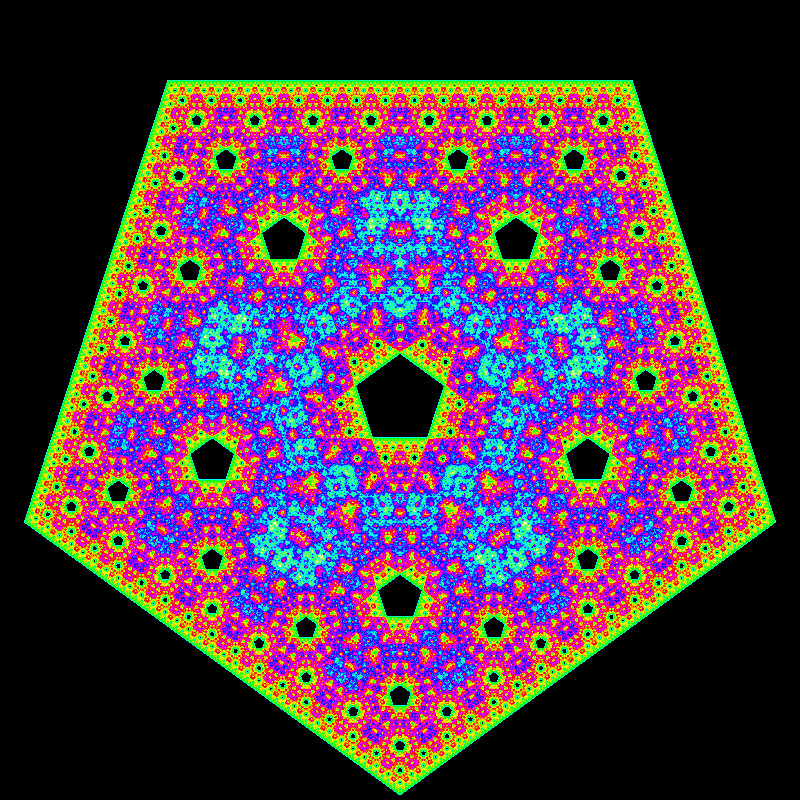
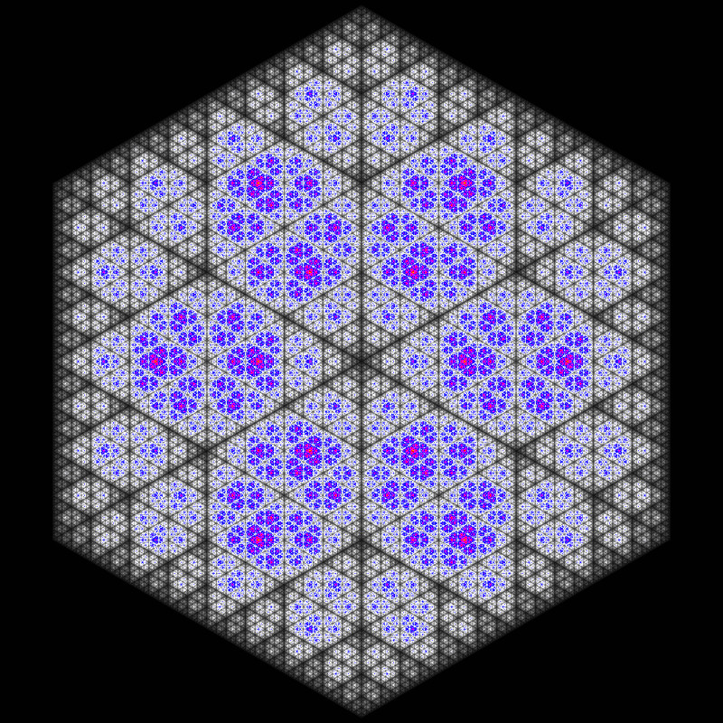
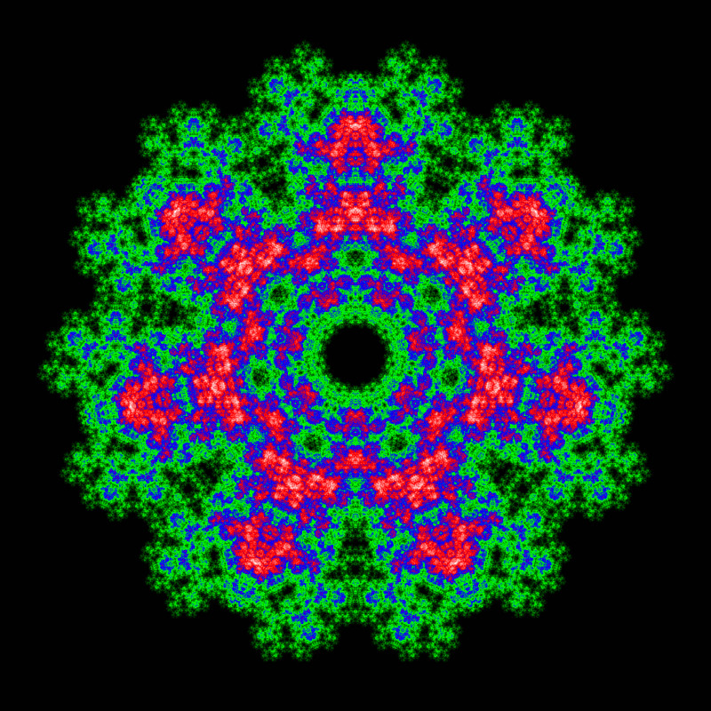
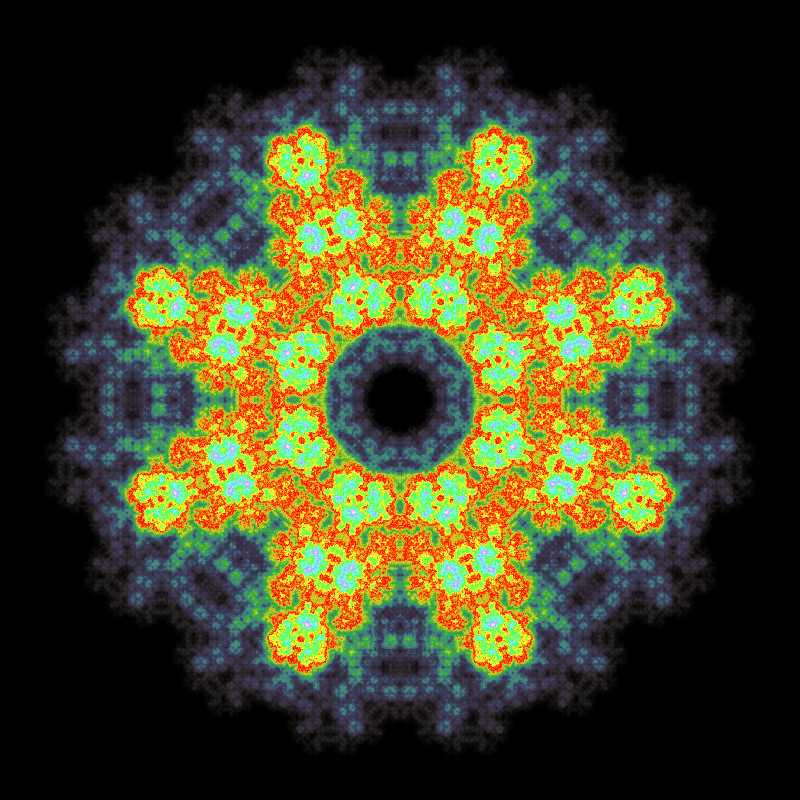

# ChaosGameFractals
Java [Chaos Game](https://en.wikipedia.org/wiki/Chaos_game) implementation using [Processing](https://processing.org/).

## Usage
By default the resolution is set to 800x800. To increase it add the resolution as command-line argument.
For example: `java -jar ChaosGameFractals-1.0.jar 4000x4000`.
Note: The resolution does not affect the preview window's resolution and only changes the resolution of the image when saving to file.

### Controls
- <kbd>&#8593;</kbd> / <kbd>&#8595;</kbd> - Increment / decrement vertex count
- <kbd>&#8592;</kbd> / <kbd>&#8594;</kbd> - Change color gradient
- <kbd>ctrl</kbd> - Toggle mode
- <kbd>s</kbd> - Save image

## Images

